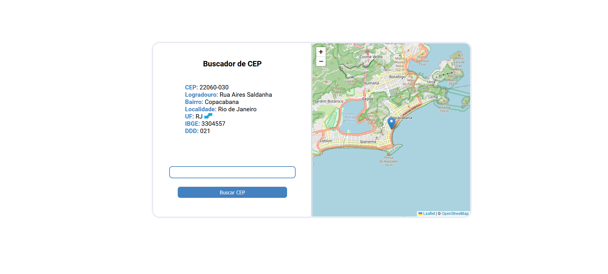
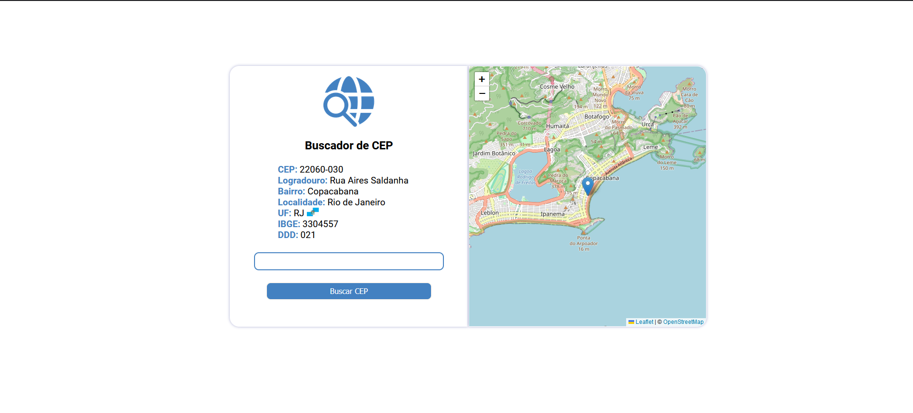

<div align="center">
 
 <h1>Buscador de CEP</h1>
</div>
<p align="center">Site rápido e prático para busca de CEP.</p>

<h1>Showcase</h1>



### Acesse clicando [aqui](https://lonelyalphaz.github.io/buscador-CEP/)

<h1>Recursos utilizados</h1>

Site desenvolvido em ```HTML5```, ```CSS3``` e ```JavaScript``` e APIs do ```ViaCEP``` (para acessar os dados de CEP fornecidos pelo usuário), ```Leaflet``` e ```OpenStreetMap``` (para a coleta dos dados de latitude e longitude e exibição do mapa).
